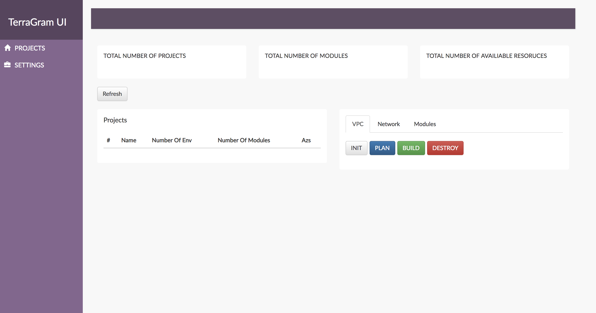

# TerraGram

I decided in between jobs to review an idea I experimented with about a year ago, a gui tool to manage infrasture deploy through terraform.The documentation is light for now as this is a initial mvp.

## Overview

This application will run terraform init, plan, build, and destroy against all associated modules within a project. Please reffer to the infrastructure readme for more info on terraform arch used to demo this project.

**APP**: The application use the following command to start

Start: `go run ./terraform-ui/app/main.go --config /config/options.cfg;`

**UI**: The ui is a basic react app nothing special.

Start: `npm start`
